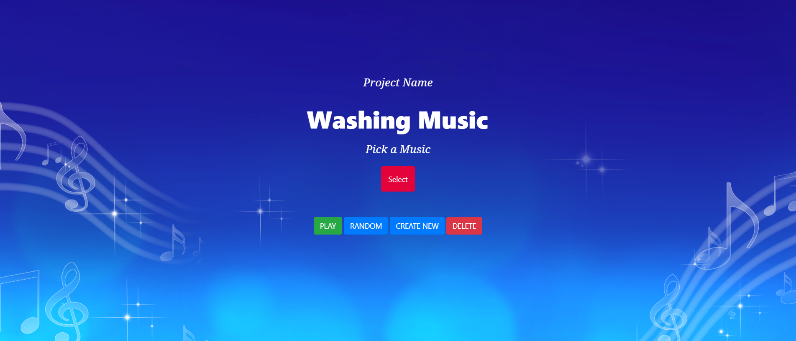

# Washing Music

<p align = "center">
    
</p>

## Description

- Web Application that can create music to play during hand wash. Since it's new normal and washing is very common thing that every one does, Why don't we make it a little more interesting? This web-app features will include music creation, music preview, random selection and hand washing count. So you can choose the music from the interface and it will be play on the machine while you are washing your hand.


## Installation Guide

Since we didn't deploy our project so you can clone this repository or download zip file

- In your directory type this command.
```shell
git clone https://github.com/lazycodex/xyz/
```
- Open the index.html file

## User's Guide

- Select the music from the index page and press *Play* button. After you press the music will be play on the machine and start to count your hand washing.

- Another choice if you don't like our default music. You can create the new one at create page. You need to fill up 40 notes otherwise it will not match our requirement since we play double speed and 40 notes is suitable for that.

- After created you need to press the submit button it will redirect you to index page and then you can follow our first guideline.

 
